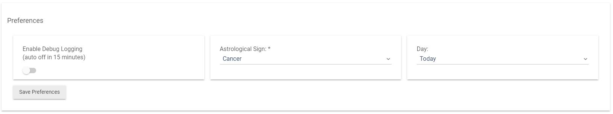

<h1 align="center">Hubitat Horoscope</h1>

Horoscope driver for the hubitat smart home center.

#### Links
- [Repo](https://github.com/joshlobe/hubitat_horoscope "hubitat_horoscope Repo")

#### Credits
This driver uses information provided from the free public API of Aztro.
- [Aztro](https://aztro.readthedocs.io/en/latest/ "Aztro")

#### Screenshots

#### Features
- Display a daily horoscope on any dashboard.
- Select which astrological sign to display.
- Select from horoscopes for today, tomorrow or yesterday.
- Displays a daily horoscope, lucky number and time, compatible signs, mood and more.
- Display a full tile with all information, or individual tiles.

#### Driver Installation
- From the hubitat dashboard, select `Drivers code` under the `Developer Tools`.
- Click to add a `New Driver`.
- Copy/Paste the code from hubitat_horoscope.groovy into the editor.
- Click `Save`.

#### Device Installation
- From the hubitat dashboard, select `Devices`.
- Click `Add Device` and select `Virtual`.
- Enter a device name and label; and select `Horoscope Generator` as the `type`.

#### Custom Settings
- Visit the device that was just created; and scroll down to `Preferences`.
- Select the astrological sign and day to query results.
- Click `Save Preferences`.

#### Tile Creation
- Finally, visit any dashboard.
- Add a new tile, select the custom device created earlier, and `Attribute` as the template.
- Select `tilehtml` for the full display of the horoscope.

#### Schedules
When the device is created, a schedule is set to run once a day at midnight.
This will call the API to get fresh horoscope data.
To remove the schedule, simply uninstall the device.
 
#### Recommendations
- It is suggested to use a tile at least 2 x 2 (under normal styling conditions).
